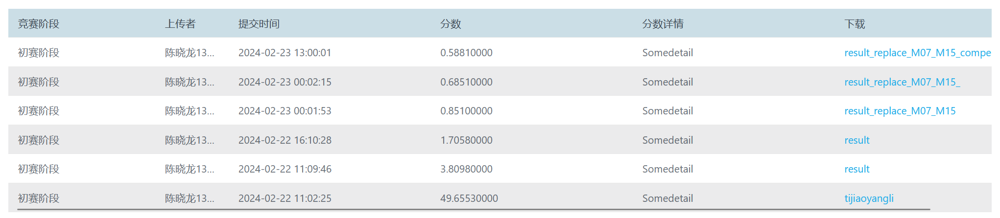
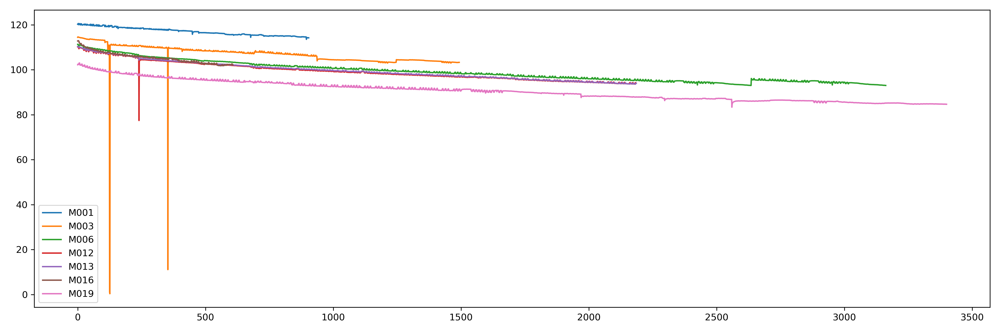
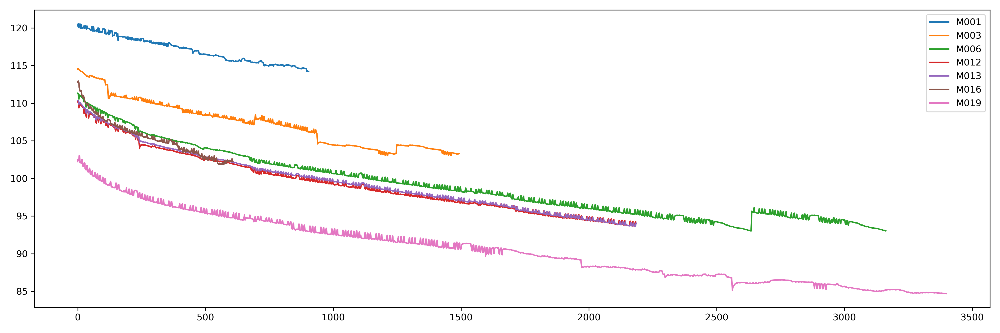

# 储能电池容量预测

新能源——储能系统电池容量预测

[数境创新大赛平台 (industrial-bigdata.com)](https://www.industrial-bigdata.com/Title)

得分情况2月23日第31名

数据分析：

​	每个电池数据保存在一个xlsx文件中，每个xlsx文件中包含三种sheet，分别是`循环数据`(1张)、`工步数据`(1张)、`详细数据`(n张)。其中`循环数据`记录了电池不同循环下的对应容量，`工步数据`记录了所有循环内的运行工步状态（包括`恒流转恒压充电`、`恒流放电`和`静置`），`详细数据`则记录了每次工步执行的具体时间。

思路：

​	首先，将每个电池的数据提取成一张表格数据，最终的表格中，每一行代表一个循环下的所有信息，包括`容量`、`工步状态的统计值`（比如该循环内静置次数为2，则静置工步数为2）、`工步执行时间`（工步具体的执行总时长）。

​	建立回归预测模型，比如`LightGBM`等，这里使用线性回归作为baseline。

问题：

​	1、部分电池中存在`工步执行时间`缺失的问题。建立时序自回归预测模型，即通过历史电池容量预测未来电池容量。这里使用`DLinear`作为baseline。输入和输出窗口大小均设置为10

​	2、存在部分电池提取的特征异常，导致预测出的容量异常。对预测结果后处理。

​	3、存在部分电池循环后期特征异常，导致预测结果异常，从循环中期开始，使用时序自回归预测未来容量。

未来可以做的改进：

​	1、这里我是使用pandas中的group来统计的工步状态，然后选择group中各部分的最大值作为工步执行的时间，然而当一个循环内某个工步执行多次时，则只能统计到执行时间最长的工步。而本来应该统计所有执行工步运行的总时间

​	2、如何选择有效特征和进行特征工程。静置时间可能导致极化效应，放电时间可以反映电池的容量。数据集中的充电时间通常过长，或者多次充电，可能是为了保证满充。有可能引入误差

​	3、进行自回归预测会导致误差累计等问题。可以考虑引入其他变量进行修正，比如考虑使用`容量`+三种`工步状态`进行回归预测下一步的`容量`。

​	4、考虑不同数据集的分布情况，选择与测试集分布类似的数据集进行训练集。

训练集中6、12、13、16和测试集5、7、8、11、15运行工况差不多。

| 恒流放电_x | 恒流转恒压充电_x | 静置_x | 恒流放电_y | 恒流转恒压充电_y | 静置_y |
| ---------- | ---------------- | ------ | ---------- | ---------------- | ------ |
| 1          | 1                | 3      | 4000       | 4100             | 600    |

可以考虑不同的预处理和后处理方式。实验发现只进行后处理效果更好。可以参考[fig](fig)文件夹下保存的实验效果。

训练集数据的原始容量

使用滑动窗口和线性插值替换掉异常值后的容量

# Acknowledge

xiaolong_chen@csu.edu.cn

